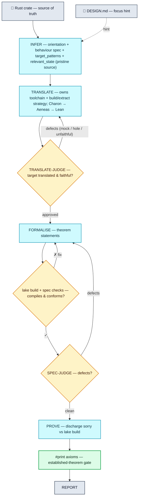

# Lusterna

An AI agent that translates Rust programs into formally verified Lean 4 specifications.

Lusterna **spawns an AI agent as the engine for each pipeline stage** — a headless agent
session, running inside the toolchain container, drives Charon/Aeneas/Lake and does all the file
and proof work itself. The Python harness is a thin, **trusted spine**: it sequences the stages and
runs the soundness gates that the agents are not allowed to touch.

Given a Rust repository and a design document, Lusterna:

1. **Infers**, from the pristine code, the behavioural properties the target functions satisfy, which
   functions the verification targets, and the minimal state the properties constrain (the design
   document is only a focus hint; the code is the source of truth). This is the first stage — it also
   orients: the entry crate and the functions that matter.
2. **Translates** the target to Lean 4 via [Charon](https://github.com/AeneasVerif/charon) +
   [Aeneas](https://github.com/AeneasVerif/aeneas), running the toolchain reality-check itself and
   owning the build-vs-extract strategy — by default lifting only the minimal core into a scoped
   extraction crate (never mocking the target away)
3. **Formalises** the properties as Lean 4 theorem statements and builds them with `lake build`,
   iterating until they compile
4. Has a **spec-judge** list concrete defects in the theorem statements (checked against the
   translation and the inferred properties); revises until the list is empty
5. **Proves** as many statements as it can with Lean 4 tactics against the `lake build` oracle
6. Runs **`#print axioms`** — the authoritative gate: a theorem is *established* only if its proof
   depends on nothing beyond the standard axioms (so an untranslated hole, a leftover `sorry`,
   `native_decide`'s compiler trust, or an assumed axiom all leave it reported as *tainted*, not
   verified)
7. Writes a **verification report** — led by a harness-generated verdict block that no agent
   narrative can override.

Each stage is one AI-agent session with its own tools; its **deliverable is files** under
`/workspace/out` (not a structured blob). The harness reads those files and applies the mechanical
gates. The session's activity is streamed to the host log live, so you can watch what it does.

## The spawn model — trust vs labor

The one line the whole design is built on:

- **The AI agent owns the labor** — reading code, driving charon/aeneas/lake, writing Lean,
  attempting proofs, judging, reporting. It brings todos, incremental file-based deliverables,
  context compaction, resume, and per-run cost caps for free.
- **The harness owns the trust** — a small, deterministic, agent-inaccessible spine: the soundness
  gates, their isolation, the audit trail, and the reproducible stage sequence. This is *precisely
  the code the AI is not allowed to write or run.*

The inviolable gates, run by the harness on the files a stage produced (never delegated to an
agent, never inferred from "it compiled"):

- **`collectAxioms`** (`lean.check_axioms`) — the authoritative established-vs-tainted verdict, the
  exact kernel axiom set `#print axioms` reports, classified in a harness-owned Lean metaprogram;
- **the mechanical spec checks** (`lean.check_spec_gate`, `lean.legitimacy_check`) — MetaM checks over
  each theorem's *elaborated type* (a spec that assumes its own postcondition; a non-strict invariant;
  a trusted assumption that references a target);
- **`lake build`** — the compile gate;
- **the pristine-baseline git diff** — the audit trail of every source edit.

A stage runs as an AI-agent session; the harness then applies that stage's gate and, if it is not
satisfied, **resumes the session with the gate's feedback** until it passes or a progress-aware
stall trips (`STALL_ROUNDS` consecutive rounds with the *same* failure — a genuinely-improving loop
is never cut off). Each session is bounded by the agent's own `--max-budget-usd`.

## Radical design choices

The harness is about 2,500 lines of Python with no real dependencies, no LLM SDK, no
agent framework, no orchestration or graph library, no vector store, no database. It contains the
trusted spine described above, i.e. the soundness gates, their container isolation, the audit trail, and
the stage sequence, and nothing else. All labor runs in a standalone coding agent spawned in the
container at each stage; the harness reimplements none of its scaffolding (planning, file IO,
retries, context management, session resume).

This is *deliberate*, because that spine is where the verification guarantee actually
lives. A language model is capable at the labor and structurally unreliable at judging its own
labor: left to grade itself it will report a theorem as proved when the proof still rests on a
`sorry`, an assumed axiom, or a compiler-trusted decision procedure; it will read "it compiled" as
"it is verified"; it will discharge an obligation it cannot prove by quietly weakening the statement
or replacing the thing under test with a mock; and it will describe all of that in a fluent,
confident report. The gates exist to make each of those outcomes fail closed, and every one of them
is computed by the harness on the files a stage produced — never by the agent, never inferred from
the agent's narrative:

- **`collectAxioms`** decides *established* versus *tainted* from the kernel's own axiom trace, so a
  leftover `sorry`, an opaqued assumption, or `native_decide`'s compiler trust taints the theorem no
  matter what the agent asserts about it — and no matter which stage authored the proof, so a
  FORMALISE-authored proof needs no separate no-smuggle guard: a genuine one counts, one resting on
  `sorryAx` is tainted.
- **the mechanical spec checks** read the *elaborated type*, not source text, so a theorem that is
  vacuous because a measurement is allowed to fail, or an assumption that quietly references a target,
  is caught where a regex could not see it.
- **the pristine-baseline diff** captures every source edit against an untouched checkout, so a
  behaviour-changing "simplification" of the code under verification is visible for review rather
  than silent.
- **the independent judge** runs as a separate session with its own context, so the faithfulness of
  a translation is screened by a party other than the one that wrote it.

This is the code that has to be read, tested, and hardened over time; it is the part where an
undetected weakness would turn a false result into a trusted one, and the part worth the attention.
Keeping it small and free of framework dependencies is what lets that attention go to the gates
themselves rather than to maintaining a framework integration or tracking an SDK's changes.

The rest of the structure follows from the same boundary:

- The agent reads the source directly in the container.
- Run state is numbered checkpoint JSON files and the output repo's git history — no database;
  containers are disposable and runs resume from a checkpoint.
- The filesystem is the container's, isolated by Docker (`--cap-drop all`,
  `--security-opt no-new-privileges`, no bind-mounts) — no virtual filesystem or sandbox shim.
- The agent runs inside that isolated container rather than through a custom tool broker — no
  separate tool-call allow-listing or sanitization layer; the security boundary is the container.
- No RAG DB — knowledge lives as code in repositories for transparency, interpretability,
  enabling sharing over transparent semantics rather than opaque vector embeddings.

Because the trusted core is small and carries no framework dependencies, a future Rust
re-implementation of the harness is bounded work: the gates and the stage sequence port directly,
while the interchangeable agent remains outside that boundary.

## Pipeline



Each stage runs with a fresh AI-agent session (fresh context — the judge's context is
independent of the author's); stages communicate via git-committed files under `/workspace/out`,
not via message history.

| Stage | Deliverable (files) | Harness gate |
|---|---|---|
| INFER | `infer/campaigns/<Campaign>.json` (`entry_file` + properties + `target_patterns` + `relevant_state`) | valid JSON with `target_patterns` |
| TRANSLATE | `lean/<Crate>.lean` + `translate/{plan,accountability}.md` | compiles · target is a real `def` (not opaqued/holed) · single top-level module |
| TRANSLATE-JUDGE | `translate/verdict.json` | empty defect list (semantic screen; independent session) |
| FORMALISE | `lean/<Crate>/Spec.lean` (statements, bodies `:= by sorry`) | `lake build` compiles · mechanical spec checks conform (`check_spec_gate`) |
| SPEC-JUDGE | `spec/verdict.json` | empty defect list |
| PROVE | proofs + supporting lemmas committed into the Lean library; any theorem that is false as stated → refuted in `Refutations.lean` + `prove/refutations.json` | `#print axioms` — three-way: established / modulo trusted base / tainted; a refutation is kernel-checked by `verify_refutations` |
| REPORT | `report/NN_*.md` | — (harness prepends the authoritative verdict) |

FORMALISE writes statements (bodies `:= by sorry`) and PROVE proves them, but nothing needs to
*force* that split: `collectAxioms` classifies every theorem by its real kernel axioms whoever wrote
the proof, so a FORMALISE-authored proof is simply judged — genuine ones count, `sorryAx`-resting ones
are tainted. The axiom gate after PROVE is the authoritative verdict; the report's headline metric —
generated by the harness, not the agent — is the number of established theorems that also reference an
Aeneas-translated def.

### Mechanical spec checks — a gate the harness enforces

The FORMALISE gate above is deliberately narrow: it never inspects a theorem's *shape*, only that it
compiles. That leaves a class of spec weakening unscreened — a theorem that **assumes its own
postcondition**. `theorem t (s s' : State) (h : transfer s = ok s') (h2 : s'.total = s.total) :
s'.total = s.total` compiles, is genuinely provable, and `#print axioms` reports it clean — it just
holds for almost any implementation. A regex over Lean source cannot detect this, because it cannot
tell which binder is a function *output*; that needs notation, implicits and coercions resolved.

So the harness ships a small Lean tool — `lean._write_lint_tool` copies
`checks/spec_checks.lean` into every crate's own tree, once, at
`lean/<Crate>/LusternaChecks.lean` — offering three checks over a theorem's *elaborated* type. **The
harness runs them itself and rejects FORMALISE on a finding** (`lean.check_spec_gate`), returning a
critique that names the theorem, the check and the rule; FORMALISE fixes it and resubmits.

That is only honest because of the SCHEMAS. Not every legitimate theorem is a forward-reasoning Hoare
triple — injectivity, determinism and other relational properties genuinely need hypotheses about
outputs — so a shape rule applied blind would reject correct work, which is why these checks were
once advisory and interpreted by SPEC-JUDGE. Now every theorem DECLARES what it is
(`@[lusterna_invariant]` / `@[lusterna_hoare]` / `@[lusterna_freeform "why"]`), and `freeform` is
where the relational properties live, out of scope by declaration. A finding on a theorem that
declared a checked schema is a fact about its own claim, so it can block. What the gate cannot see —
whether the schema declared is the RIGHT one — is what SPEC-JUDGE now spends its whole attention on.

> **The subject may revert; a measurement may not.** The function under verification may fail — if it
> reverts, nothing happened and there is nothing to prove, so its equation belongs in the binder list
> (partial correctness). But a function called to *express* a property is not the behaviour under
> test; it is how the claim is stated, so its failure must not excuse the property (total
> correctness). The fix is the `⦃ ⦄` triple, which already means exactly `∃ t, … = ok t ∧ φ t` — or,
> in a schema-conforming spec, a `Result Bool` predicate that binds the measurement.

**`assumed_postcondition`** — the strongest of the two, and the one that asks about *provenance*
rather than shape. For a stateful
`f : Input → State → Result (Output × State)`, a fact about `y`/`s'` may enter only through the
subject's own execution relation `f x s = ok (y, s')`; every other hypothesis may mention inputs and
the pre-state only. Adding `(hvar : s'.var = s.var)` to a theorem *concluding* `s'.var = s.var`
leaves it logically valid, provable by `exact hvar`, and worthless — and nothing local separates it
from the honest version, since the execution is real and `Pre x s` is a genuine precondition. Taint
closes over aliases
(`z = s'.var` then `0 < z` is the same cheat one hop away) and over further calls — and an alias is
reported as well as propagated, since `(h : s' = s)` is itself enough to close a preservation goal.
The execution binder must also bind fresh results: `f x s = ok (y, s)` asserts the post-state is the
pre-state, `ok (y, { s with var := 10 })` pins it structurally, and `ok (some y)` picks a branch —
each deciding in a hypothesis what the conclusion was supposed to claim. Every binder's type is
examined, not just `Prop`-typed ones, since `{ u : Unit // s'.var = s.var }` carries a postcondition
as data; and exemption tests the whole binder, never the arguments alone, since `g z = ok y` runs on
clean inputs while pinning the subject's own output. Being a target grants provenance, not the right
to consume it, so a theorem that runs its target twice must declare it a continuation as well. Each
output has exactly one producing execution — `(h1 : f x = ok y) (h2 : f z = ok y)` is injectivity's
relational premise with the equality hidden in the binder names. Because the conclusion is exempt
from the binder rule, it is walked compositionally instead — through `∧`, `∃` and arbitrary wrappers,
unfolding project-local definitions at the use site and instantiating the constructor fields of
Prop-valued structures — so an antecedent cannot move there, including into a `⦃ ⦄` postcondition,
whose lambda-bound post-state is seeded and analysed rather than assumed harmless. Being
execution-shaped earns a hypothesis nothing: `(hcheat : checkVarPreserved s s' = ok ())` is a
predicate wearing an execution's shape, closed by `simp [checkVarPreserved] at hcheat; exact hcheat`,
and even a contentless `(hok : total s' = ok t)` restricts the theorem to post-states where that call
happens to succeed. Only three fallible calls are trusted — the subject's own execution, a
*declared* continuation (opt-in, for a theorem genuinely about a composition), and a call on
entirely clean arguments, which is what an ordinary precondition looks like. A useful side effect:
a post-state measurement guard is reported wherever it sits, with the prescribed fix being the
`⦃ ⦄` triple. It must be *told* the target functions: without them a
precondition stated through a pre-state measurement reads identically to a cheat, so an unsupplied
target reports "skipped", never "clean". Two accepted false positives, both unavoidable — a
relational antecedent (injectivity's `a = b` is a hypothesis about outputs by construction) and a
bound on an intermediate result, which is simultaneously an overflow guard and a domain restriction.

**`invariant_not_strict`** — the third check recognises one *particular theorem*, the
invariant-preservation theorem, and asks the only question that makes it worth proving: if a
measurement inside the invariant fails, does the invariant come out **false**? If not, the theorem
admits pre-states nobody could describe — `total_supply` reverts, so the invariant holds for free —
and any counterexample is an artefact of the spec. The invariant form it certifies is a
`Result Bool` `def` claimed as `Inv s = ok true`, chosen because strictness is then a theorem about
the monad rather than a heuristic: `bind (fail e) k = fail e`, `bind div k = div`, and `ok true` is
neither, so a body that only *binds* its fallible calls cannot answer `ok true` after one failed —
divergence included, for free.

The fragment is one rule: **a `Result` may be bound or returned, never passed.** If nothing ever
*receives* a `Result` value, nothing can observe — hence discard — a failure. So `bind`'s first
argument, a pure-scrutinee `ite`/`match`'s branches, and the body's tail are the only places a
`Result` may appear; every argument of every call must be `Result`-free, and the fallthrough is a
finding rather than a shrug. That is what makes it *closed* instead of a blocklist forever chasing
Aeneas's helper set: `ok (! ok? (total_supply s))` is rejected because the measurement sits in an
argument, not because `ok?` is named — and by the same rule `Result.ofOption` stays clean, since it
never receives a `Result` and so cannot launder one. Recursive invariants certify, which is what
separates a useful check from a toy: a real invariant folds over accounts, `dv.value` for such a
`def` is `fun l => List.brecOn l Inv._f`, so the walk reads the *equation lemmas* instead —
structural and well-founded recursion alike. Project-local callees are followed to exhaustion, so a
fail-open leaf four one-line wrappers down is still found. Findings carry two severities:
`fail_open`, where a `Result` genuinely is handed to something that can drop its failure, and
`not_certified`, which claims only that the walk could not certify — an `opaque` or `partial`
invariant, or `List.foldlM`, which is almost certainly strict (`Result` has no `MonadExcept`
instance, so a combinator has nothing to catch failures *with*) but is reported rather than assumed.

The shape gate is deliberately narrow, false negatives being the accepted cost: the same invariant
constant in a hypothesis and in the conclusion, differing at exactly one argument position whose
pre-state the execution consumes and whose post-state is one of that execution's own outputs, for a
declared target. One consequence worth stating plainly — `invariant_not_strict`'s *silence* is weaker than the
other two's, because a theorem of no relevant shape is passed over in order not to print a line per
theorem; a **near miss**, where the conclusion is `Inv … = ok true` but the rest of the shape is
absent, is therefore reported as `SKIPPED`, which is exactly the case where a reader would otherwise
believe the check ran. Checks 2 and 3 appear to disagree about `Inv s' = ok true` and do not: check
`assumed_postcondition` flags it as a *hypothesis* (there it carries the whole conclusion), the
invariant schema requires it as the *conclusion* (which `assumed_postcondition` exempts), with only
the pre-state form among the hypotheses.

**`schema_conformance`** — the first three checks hunt for bad shapes, which makes their *silence*
ambiguous: "clean, or nothing I recognise". The fourth inverts that. FORMALISE annotates each theorem
with the schema it was written to — `@[lusterna_invariant]`, `@[lusterna_hoare]`, or
`@[lusterna_freeform "why"]` for a supporting lemma — and this verifies the annotation. Default-reject
is safe here and nowhere else: applied to arbitrary theorems the rule would flag every honest use of
`→`, `∨` and `¬`, which is exactly why the vacuous-guard check is a targeted pattern flagger instead;
applied to a theorem whose author *declared* its schema, it is exact. The annotation is what buys the
strictness, and it generalises a doctrine already present in the continuation list — declaring
something switches off a real check, so you declare because the property demands it.

All three are gated, unconditionally: `checkSpecGate` composes them, applying a theorem's declared
schema first and the provenance/strictness rules only once its shape is right, so a rejection carries
the one message that can be acted on rather than a pile of consequences. `freeform` theorems are
exempt from the shape rules by declaration. Each finding names the rule that broke. Two of those
rules earn their
keep beyond bookkeeping. `postcondition_ignores_output` is what stops a conforming theorem from being
vacuous: the data binders that name outputs in advance (`ok (.Ok eff, vfinal)`) are not propositions,
so the precondition rule never sees them, and nothing else would force `Post` to mention them — with
an exemption for types that carry no information, so an Aeneas void function's `Unit` is not demanded.
And `hypothesis_not_a_precondition` is where `assumed_postcondition`'s "bound on an intermediate"
false positive goes: no longer a finding to adjudicate every time, but a conformance failure with a
prescribed fix — move the bound into `Pre`, where it becomes a named, inspectable object. Injectivity
and the other relational antecedents are simply not `hoare`; they declare `freeform`, which is a more
honest answer than being flagged. What conformance cannot establish is that the *declared* schema is
the right one for the property: the annotation is written by the same agent whose work is checked, so
it verifies form, not fitness, and that judgment stays with SPEC-JUDGE.

`tests/checklean/` is the regression suite for all three checks: a fixture crate of theorems that must
fire and controls that must not (including the pinned false positive and the accepted misses), run
against the real toolchain by `python tests/checklean/verify.py`, which drives the checker through
the exact invocation the judge's doc prescribes. `LUSTERNA_CHECK_SKIPPED` records are pinned there
too, so "clean" can never quietly mean "never ran".

A measurement allowed to fail its way to true is a pure weakening in a *postcondition*; in a
*precondition* it instead admits states nobody meant to allow, producing unprovable goals and
counterexamples that are artefacts of the spec rather than bugs in the code. Because the tool
inspects the built environment, it follows predicates referenced from a theorem's statement into
**imported** modules — a prior campaign's spec or a PROVE helper module — which the harness never
reads as source.

The same investigation hardened declaration recognition in the harness's remaining source scans.
Every regex that finds a `theorem`/`lemma` once required the keyword to be the first token on its
line, so `@[progress] theorem foo …` and `private theorem foo …` were invisible to all of them at
once — including the theorem *enumeration* `check_axioms` feeds to `collectAxioms`, and
`theorem_statement`, where it meant the headline metric quietly reclassified such a theorem as an
abstract helper. A shared `_DECL_PREFIX` pattern now covers attributes and modifiers in every one of
those places, `def` included — Aeneas itself emits `@[global_simps, irreducible] def <Crate>.CONST :
… := …` for crate constants, which the def scan behind `referenced_defs`, `target_defs` and the hole
count had been skipping. These scans are the remaining source-text plumbing — theorem/axiom
enumeration and the impl-vs-abstract def scan feed *reporting and discovery*, not the established/
tainted verdict, which is now purely `collectAxioms`; `tests/` pins the attribute and modifier forms.

## TRANSLATE

TRANSLATE is where the target Rust becomes Lean. The session drives Charon and Aeneas at the shell,
scoping to the target's functions (`--start-from`) and getting the target's own logic translated as
real Lean `def`s. Aeneas has a limited Rust fragment, so on larger targets some dependencies do not
translate. The session handles each by the least-degrading option that works:

- **scope** — `--start-from` the target's call-closure and drop out-of-closure noise;
- **assume** — `--opaque` a trusted leaf dependency the properties do not reason about (crypto,
  hashing, transcripts, formatting); Aeneas emits it as a Lean `axiom`, which the `#print axioms`
  gate then flags on any theorem that depends on it;
- **model** — a behaviour-preserving source refactor when a data structure the properties *do*
  depend on has no Lean model (e.g. a `BTreeMap` ledger → an association list); confirmed against the
  crate's own `cargo test` and recorded, with the diff, in `translate/accountability.md`.

The translation is then held to three things, in order — two mechanical gates and one semantic judge:

1. **Compile gate** — `lake build` accepts it (a single top-level module, no split files).
2. **The taint gate** (`lean.target_footprint_gate`, the `checkDefAxioms` MetaM check) — a **hard,
   fail-closed** gate: no target function may transitively rest on an opaque axiom. It runs
   `collectAxioms` — the *same* closure the PROVE `#print axioms` gate takes — over each target `def`
   at translate time, so a leak is caught in seconds rather than after a $100 PROVE. Because that
   closure covers a function's whole body (error, panic, and formatting branches included), it catches
   an opaque leaf reached through a "harmless" path — a modelled type whose `Display`/`serde` was
   delegated back to the opaque original, a `Pubkey` field that rode along in a struct, a
   `native_decide` helper — every one of which would taint every downstream theorem. A *clean*
   translation (the sanctioned design — substrate modelled as real defs, irrelevant surface dropped)
   has an **empty** target footprint; a non-empty one blocks the round with a categorised, actionable
   critique (drop the formatting surface, project the field away, replace the `native_decide`). It
   fails **closed**: a build/driver failure, or zero targets matched (the false-clean a name mismatch
   produces), blocks — silence is never "clean".
3. **TRANSLATE-JUDGE** (a separate, independent session) — the *semantic* screen the machine cannot
   do. It rejects a translation that mocks the target (`target_mocked`/`holes_in_target`), under-models
   a property-bearing dependency (`over_opaqued`), changes observable behaviour (`semantics_changed`/
   `not_faithful`), or — the relevance check — **keeps surface outside the minimal core**
   (`irrelevant_surface`). "Irrelevant" is not a free judgement: INFER declares `relevant_state`, the
   exact struct fields and value-types the properties constrain, and anything modelled or kept outside
   it — a field no property reads, a modelled `Display`/serde, a heavyweight helper for something
   unused — must be dropped, *even though it compiles and is taint-clean*. The taint gate owns
   soundness (goals not tainted); the judge owns minimality (no garbage in), against INFER's declared
   core.

If the target cannot be translated without mocking it, the run aborts rather than emitting a hollow
translation.

To make the session recognise-and-apply rather than rediscover Aeneas's fragment every run, the
translatability playbook (`docs/skills/aeneas-translate.md`) is appended to the TRANSLATE briefing —
a verdict table (what translates / opaques / holes / rejects), the modelable-stdlib line,
behaviour-preserving recipes, and the charon/aeneas mechanics.

### The translatability inventory

The playbook is **measured**, not folklore. Aeneas's translatable fragment is defined by the
toolchain, so `tools/aeneas-characterize/` measures it directly rather than relying on anecdote:

- **What it does.** `characterize.py` runs a corpus of tiny single-construct probe crates (a
  `BTreeMap`, an iterator chain, an `Option` combinator, a closure, a trait object, …) through
  charon+aeneas once, in the toolchain image, and records the verdict for each — `def` (translates)
  / `axiom` (opaqued, no Lean model) / `hole` (`sorry`) / `error` (rejected). It also extracts
  Aeneas's builtin registry (`extract/ExtractBuiltin*.ml`) — the authoritative "what stdlib has a
  Lean model" set that decides def-vs-axiom. Output: `characterization.json`.
- **How to run it.** `python tools/aeneas-characterize/characterize.py` (needs the toolchain image
  and the editable-installed package). It prints a table and writes the JSON.
- **When.** On a toolchain-image bump — the fragment is version-specific. Then reconcile the
  playbook's verdict table and recipes with the fresh `characterization.json`.

## PROVE

PROVE discharges the `sorry`-bodied statements, and like every other labor stage it is *not*
refereed by the harness. It runs one budgeted, resumable agent session — the per-stage
`--max-budget-usd` is the hard stop — and the agent drives an ordinary, cumulative Lean development:
proving supporting lemmas, giving the translated functions and their loops the `@[progress]` spec
lemmas a bottom-up proof needs, and committing as it goes. Git is both the persistence and the
safety net (a session that leaves the build red falls back to its own last green commit); `#print
axioms` over the committed library is the sole arbiter. There is no scoring, stall-detection, or
rollback logic in the harness — that machinery constrained the agent against the grain of how proofs
are actually built, and it is gone.

A hard obligation can bottom out in a fact that is *true but intractable to prove at this modelling
altitude* — typically the value semantics of a low-level primitive the translation reproduced
bit-for-bit (e.g. a multi-limb fixed-point multiply-divide whose faithful Lean model is a
256-iteration restoring-division loop). For these the agent may declare a **trusted assumption**: a
general `axiom` in a dedicated `lean/<Crate>/Assumptions.lean` stating the primitive's value
contract, and then prove the rest *modulo* it. The trust is disclosed, never hidden — `#print
axioms` still reports the dependency — so the verdict is three-way rather than binary:

- **established** — the proof rests only on the standard axioms (`propext` / `Classical.choice` /
  `Quot.sound`);
- **established modulo the trusted base** — rests only on those plus declared assumptions (each
  listed with the theorems that use it);
- **not established** — a leftover `sorry` or a non-standard axiom; verifies nothing.

This is the proof-time analogue of TRANSLATE's `--opaque` (assume an untranslatable *leaf*): here we
assume an *unprovable substrate fact*, disclosed the same way. And it is bounded by the same
principle that keeps the whole harness honest — it can never launder a goal into the trusted base. A
declared assumption may reference **only the substrate, never a target function under verification**
(the harness checks each assumption's statement against the INFER `target_patterns`; an assumption
that mentions a target is refused and any theorem leaning on it is demoted to *tainted*). Since a
goal states a property *of* a target, no goal can be admitted as an assumption — if it cannot be
proved it stays an honest `sorry`. The assumptions are general and reusable across campaigns, and can
later be *discharged* — proved against a value model — to retire the trust entirely.

### Counterexamples — when a property is *false*

Sometimes the sustained effort to prove a theorem instead surfaces a **counterexample**: the property
simply does not hold for the code as written (a classic case is an unguarded arithmetic overflow the
statement forgot to exclude). This is not a failure — finding it is the most valuable thing the
pipeline can produce. Rather than leave an unprovable `sorry`, PROVE *refutes* the theorem: it proves
the negation as a `<name>__refuted` lemma in a dedicated `lean/<Crate>/Refutations.lean` (a concrete
counterexample, so `decide` / `native_decide` is admissible here) and records it in
`prove/refutations.json`. The harness verifies the refutation mechanically — the dual of the proof
gate — with two checks: a **type tie** (`example : False := <name>__refuted <name>` type-checks, so
the refutation targets the *exact* statement, not a strawman) and **purity** (`#print axioms` clean of
`sorryAx`). A refutation passing both is surfaced as a **headline finding** in the verdict and report:
a kernel-verified discrepancy warranting investigation. The prover never edits the statement to make
the counterexample vanish (statements are FORMALISE's, and the spec was already independently judged
by SPEC-JUDGE), and a refutation is a *falsehood* — it can never enter `Assumptions.lean`, the
trusted-*true* ledger. It is reported, not papered over.

## Architecture

```
lusterna/
├── cli.py          — Click entry point; manages the container lifecycle
├── pipeline.py     — The spine: per-stage functions that spawn an AI-agent session and apply
│                     the trusted gate (the _cc_gate_loop / PROVE best-loop), + run_session
├── runner.py       — run_cc_stage: launch `claude -p` headless in-container and stream its
│                     stream-json activity to the host log; mint/resume the session id
├── briefings.py    — The task briefing per stage (the spawn-model prompt library)
├── lean.py         — Aeneas/Lean domain logic: translation analysis, lake build, the
│                     collectAxioms gate (check_axioms), the MetaM check drivers, spec operations
├── checks/         — harness-owned Lean SOURCE: spec_checks.lean (the MetaM checks) +
│                     spec_schemas.lean (the @[lusterna_*] schema attributes), shipped per crate
├── tools.py        — The harness's own file/git IO helpers inside the container (not agent tools)
├── schemas.py      — AgentDeps (the shared dependency handle)
├── docs.py         — Aeneas/Lean skill documents appended to the relevant briefings
├── container.py    — Docker lifecycle: start, push repo, exec, exec_stream, export the run branch
├── checkpoint.py   — Per-session numbered checkpoints + snapshot(deps) serialisation
└── config.py       — Env-driven knobs, plus logging setup

tools/aeneas-characterize/   — build-time harness that measures Aeneas's translatable
                               fragment (see above); seeds the TRANSLATE playbook.
```

There is no in-process LLM SDK: the engine is the `claude` CLI (installed in the toolchain image),
invoked over `docker exec`. `pydantic-ai` was retired with the spawn-model migration.

## Docker interaction

The toolchain (Rust/Cargo, Charon, Aeneas, Lean/Lake) **and the AI agent itself** (Node + the
agent CLI) live entirely inside a Docker container. There are no bind-mounts: the source repo is
pushed in via a tar pipe at session start, and at the end the run's git branch is fetched back into
the target repo.

- The container has its own isolated filesystem — no host paths are exposed. The whole run is ONE
  git repo at `/workspace/repo`: the source is git-initialised at a pristine baseline (so any
  behaviour-preserving edit is captured as a diff) and every stage commits onto branch
  `lusterna/<session>`. Generated artefacts live in that repo's `verification/` subtree, exposed at
  the stable path `/workspace/out` via a symlink.
- Each stage runs as `docker exec … claude -p …` inside the container, with `ANTHROPIC_API_KEY`
  forwarded (never written to a file). Autonomy is `--permission-mode dontAsk` + an explicit tool
  allowlist (`bypassPermissions` is refused as root), and `--max-budget-usd` caps each session.
- The container runs with `--cap-drop all` and `--security-opt no-new-privileges`. Network is
  enabled so Charon can `cargo build` targets whose dependencies are fetched on demand, and so
  the agent can reach the Anthropic API.

## Checkpoints & resuming

After each stage the harness saves a numbered checkpoint under a per-session directory:

```
~/.local/share/lusterna/sessions/<session-id>/checkpoint-001.json …
```

Each records the progress dict (incl. per-stage agent session ids and costs), container ID,
repo path, design doc, and the `git_head` SHA of the run branch at save time.

An interrupted run (a stage session failing unrecoverably, or a graceful abort) is stopped
gracefully — never a traceback — and its container is **kept alive**, so a resume re-attaches to it
with full in-stage state and continues rather than restarting the stage. Only if that container is
gone does resume rebuild a fresh one: it restores the repo (source edits, `verification/`, and the
branch) from the run branch already fetched into the target repo, and hard-resets to the
checkpoint's `git_head`, continuing from exactly that state.

When resume must start a **fresh agent session** (its predecessor's in-container conversation is gone
with the dead container), the work carries across on **disk, not in the agent's memory**: the stage
briefing tells every resumed session to first re-read the committed artefacts — the translation, spec
modules, established lemmas, and its own `prove/` notes (`assumptions.md`, `refutations.json`) — and
continue from them rather than re-derive. Artefacts are streamed to disk *as* a stage works, not only
at its end, so a resumed session that skipped them would be "unprimed" and re-tread banked work.

```sh
lusterna list-sessions
lusterna list-checkpoints <session-id>

# Resume from the latest checkpoint (or a specific one with --checkpoint-number N).
lusterna run /path/to/repo design.md --session-id <uuid>
```

## Incremental runs

Distinct from resuming: an incremental run is a **new session seeded from a prior run's branch**, so
a fresh campaign builds on earlier work instead of starting over. You pass the prior run's branch as
the seed:

```sh
lusterna run /path/to/repo new-campaign.md lusterna/<prior-session>
```

The prior branch's tree (translation, spec, proofs, source edits) becomes the starting point and the
`-base` anchor, so `git diff lusterna/<new>-base lusterna/<new>` is exactly what the new campaign
added. **What to reuse vs. redo is driven by the instruction document, not by flags** — every stage
is told a prior artefact may already be present and reconciles it against the new instruction
(reuse / extend / revise). Two motivating cases:

- **Grow a campaign** — a new instruction that adds properties: the TRANSLATION is reused, INFER
  adds the new properties, FORMALISE/PROVE handle the delta, and prior proofs carry over.
- **Close remaining `sorry`s** — an instruction to finish the open obligations: everything upstream
  is reused and PROVE re-attacks just the unproven theorems (with more budget/effort).

Reuse saves **labor**, never **trust**: the branch carries Lean *source text* (defs, statements,
proof scripts) but not the compiled `.lake`, so every run rebuilds and re-runs `#print axioms` over
the whole final state — a reused proof is re-verified from scratch, not inherited on faith.

## Requirements

- Python 3.10+ (only `click`; no LLM SDK)
- Docker (with access to the Docker daemon)
- An Anthropic API key (`ANTHROPIC_API_KEY`) — forwarded into the container per stage

## Installation

```sh
python3 -m venv .venv
source .venv/bin/activate
pip install -e .
```

## Quickstart

```sh
# 1. Build the toolchain image (one-time — includes the Rust/Lean toolchain + Node + the claude CLI)
lusterna build-image

# 2. Run the pipeline
export ANTHROPIC_API_KEY=sk-...
lusterna run /path/to/rust-repo /path/to/design.md

# The results land as a git branch in the target repo. Review the whole run with:
#   git -C /path/to/rust-repo diff lusterna/<session>-base lusterna/<session>
```

## Commands

```
lusterna run REPO DESIGN_DOC [BRANCH] [OPTIONS]
```

`BRANCH` (optional) is the commit the run **seeds from** and anchors `<branch>-base` at — its tree is
the starting point. Omit it to seed from the target's current `HEAD` (or, for a non-git target, a
synthesised pristine baseline). Pass a prior run's `lusterna/<sid>` branch to make the run
**incremental**: the earlier translation/spec/proofs are reused and only the delta is recomputed
(see [Incremental runs](#incremental-runs)).

| Option | Default | Description |
|---|---|---|
| `--session-id ID` | (new UUID) | Resume a previous session |
| `--checkpoint-number N` | (latest) | Checkpoint to resume from within a session |
| `--container NAME` | (auto-start) | Attach to a pre-running toolchain container |
| `--image TAG` | `lusterna-toolchain:latest` | Image to start when `--container` is not given |

The run's results are fetched into `REPO` as branch `lusterna/<session>` (with `lusterna/<session>-base`
for diffing); `REPO` is git-initialised if it is not already a repo, and its working tree and any
existing branches are left untouched. Output is JSON on stdout (`session_id`, `repo`, `branch`,
`container_id`, `summary`, `progress_keys`); the live per-stage activity trail and progress go to
stderr as structured log lines.

```
lusterna build-image [--tag TAG]      # build the toolchain image (required before the first run)
lusterna list-sessions                # sessions that have at least one checkpoint
lusterna list-checkpoints SESSION_ID  # checkpoints for a session (JSON)
lusterna show-checkpoint SESSION_ID [--number N]   # a checkpoint's state (JSON)
```

## Environment variables

| Variable | Default | Description |
|---|---|---|
| `ANTHROPIC_API_KEY` | — | **Required.** Anthropic API key, forwarded into the container |
| `LUSTERNA_CC_MODEL` | `opus` | The `claude --model` alias for the spawned stage sessions |
| `LUSTERNA_EFFORT` | `high` | Reasoning effort (`--effort`): "", low, medium, high, xhigh, max |
| `LUSTERNA_CC_STAGE_BUDGET_USD` | `50` | Per-stage `--max-budget-usd` cap — a runaway backstop, not a work limiter |
| `LUSTERNA_STALL_ROUNDS` | `3` | Consecutive **same-failure** rounds before a stage's gate loop gives up (no hard round ceiling; a progressing loop continues) |
| `LUSTERNA_BUILD_TIMEOUT` | `180` | Per-`lake` timeout (seconds) |
| `LUSTERNA_SESSIONS_DIR` | `~/.local/share/lusterna/sessions` | Root for per-session checkpoints |
| `LUSTERNA_IMAGE` | `lusterna-toolchain:latest` | Default Docker image |
| `LUSTERNA_CONTAINER` | — | Pre-existing container to attach to (skips auto-start) |
| `LUSTERNA_STOP_AFTER_INFER` | (off) | Stop after INFER so the inferred spec + target scope can be inspected |
| `LUSTERNA_STOP_AFTER_TRANSLATE` | (off) | Stop after TRANSLATE so the translation can be inspected |
| `LUSTERNA_STOP_BEFORE_PROVE` | (off) | Stop after SPEC-JUDGE so the inferred spec can be inspected |
| `LUSTERNA_LOG_LEVEL` | `INFO` | `DEBUG` / `INFO` / `WARNING` / `ERROR` |

Model retry, context compaction, and cost caps are owned by the AI agent itself, so there are no
knobs for them here.

## Output artefacts

After a run, the target repo carries branch `lusterna/<session>` with one commit per stage (the
multi-GB `.lake` build tree is excluded). The branch holds the original source (plus any
behaviour-preserving edit TRANSLATE made) and all generated artefacts under `verification/`:

The mental model: `lean/` is the verified artifact; every other dir is one stage's trail.

```
<repo>/  (on branch lusterna/<session>)
├── …                             — the original source, plus any TRANSLATE source edit
└── verification/
    ├── lean/                      — the verified Lean project (unchanged layout — lakefile-driven)
    │   ├── <Crate>.lean           — Aeneas translation (root module)
    │   ├── <Crate>/…              — translation submodules + <Crate>/Spec.lean (the theorem spec)
    │   └── lakefile.lean          — Lake project file
    ├── infer/campaigns/<Campaign>.json — entry_file + properties/invariants + target_patterns + relevant_state
    ├── translate/                 — plan.md, accountability.md, source.diff, facts.json, verdict.json
    ├── spec-judge/verdict.json    — the spec-judge verdict
    ├── report/                    — axioms.json (authoritative verdicts) + the report sections
    └── VERIFICATION_REPORT.md     — led by the harness's authoritative #print axioms verdict, then
                                      theorem status, assumptions, and proof sketches
```

Review the whole run as a single diff:

```sh
git -C <repo> diff lusterna/<session>-base lusterna/<session>
```
