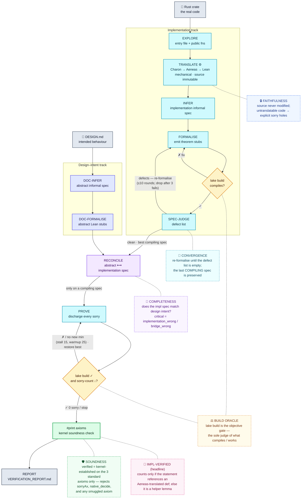

# Lusterna

An AI agent that translates Rust programs into formally verified Lean 4 specifications.

Given a Rust repository and a design document, Lusterna:

1. Derives an **abstract specification** from the design document alone — before looking at any code
2. Explores the source code
3. Translates the Rust code to Lean 4 via [Aeneas](https://github.com/AeneasVerif/aeneas)
4. Infers an informal specification from the translated code and the design document
5. Derives a formal Lean 4 specification (theorem stubs with `sorry`)
6. Verifies the spec compiles with `lake build`; iterates until it does (max 3 attempts)
7. Has a spec-judge list concrete defects in the theorem statements (checked against the code and the informal spec); revises until the defect list is empty
8. **Reconciles** the abstract spec against the implementation spec — classifies discrepancies and flags critical ones (implementation bugs, mis-stated theorems)
9. Attempts to fill in proofs using Lean 4 tactics; the orchestrator ends the stage when no `sorry` remain, the remaining-`sorry` count stops improving, or a round cap is hit
10. Writes a final verification report

All generated artefacts are git-committed incrementally inside the toolchain container and pulled to the host on exit.

## Architecture

The package is organised by responsibility — orchestration, stage-running machinery,
domain operations, and the agent I/O surface are separate modules:

```
lusterna/
├── cli.py          — Click entry point; manages the container lifecycle
├── pipeline.py     — The pipeline itself: the stage phases (SpecPhase, ProvePhase),
│                     the linear stage drivers, and run_session sequencing them
├── runner.py       — Generic stage-running machinery: per-stage prompt briefing,
│                     running a stage agent with history/limits, and tool wiring
├── stages.py       — Stage-agent definitions (prompt + output type per stage)
├── factory.py      — Agent factory: stage-agent construction + shared hooks
│                     (token tracking, compaction summariser, budget, history)
├── lean.py         — All Aeneas/Lean domain logic: run_aeneas, check_lean,
│                     #print axioms partition, call-closure/footprint analysis,
│                     and the implementation-spec operations
├── tools.py        — Agent-callable file & git tools (the plain I/O surface)
├── schemas.py      — AgentDeps (the injected dependency bundle) + all Pydantic
│                     structured-output schemas
├── docs.py         — Aeneas/Lean skill documents embedded as agent instructions
├── container.py    — Docker lifecycle: start, push repo, exec, reset/pull artefacts, stop
├── checkpoint.py   — Per-session numbered checkpoints + snapshot(deps) serialisation
├── telemetry.py    — Session-wide token-usage tracking
└── config.py       — All env-driven knobs, plus logging setup
```

### Pipeline

> **The core invariant:** the pipeline never claims a property is _verified_ unless
> Lean's kernel agrees. "Verified" means **kernel-established on the standard axioms only**
> _and_ the theorem statement references the real, mechanically-translated code.
> Everything else is reported honestly as unproven or as an abstract helper.



The same flow, annotated with the artefact each stage commits and the tools it uses:

```
CLI
 └─ start container
     └─ tar-pipe repo → /workspace/repo
     └─ git init /workspace/out
         └─ Python pipeline (pipeline.py) driving per-stage agents (pydantic-ai)
             ├─ DOC-INFER    → specs/abstract_informal_spec.json  (git commit)
             │                structured output (design doc only, no code)
             ├─ DOC-FORMALISE → specs/abstract_formal_spec.lean  (git commit)
             │                structured output (abstract informal spec → Lean stubs)
             ├─ EXPLORE      structured output (ExploreResult); Rust sources injected,
             │                no tools — identifies entry file + public functions
             ├─ TRANSLATE    Charon → Aeneas → lean/  (git commit) — MECHANICAL
             │                source is immutable; untranslatable constructs become
             │                explicit `sorry` holes; hard-failure aborts (no rewriting)
             ├─ INFER        → specs/informal_spec.json      (git commit)
             │                structured output; orchestrator injects Lean translation +
             │                abstract informal spec directly into the prompt
             ├─ FORMALISE    structured output (FormalSpec); no tools — the agent emits
             │                theorem stubs, the orchestrator assembles them into the spec
             │   + BUILD     (lake build) — the orchestrator's convergence gate
             ├─ SPEC-JUDGE   (re-formalise until no defects remain, up to 10 rounds)
             │                structured output; lists defects in the impl spec, judged
             │                against the code + informal spec (approval = empty list)
             ├─ RECONCILE    → specs/reconciliation.json  (git commit)
             │                structured output; orchestrator injects abstract + impl specs
             │                classifies discrepancies:
             │                  implementation_wrong / bridge_wrong (CRITICAL)
             │                  abstract_wrong (minor) / design_doc_silent (gap)
             ├─ PROVE        patch_output_lines, write_file, check_lean, git (tools)
             │                attempts every sorry theorem; orchestrator ends the stage
             │                on build-verified sorry count (0 / no improvement / round cap)
             └─ REPORT       write_file, git_log → VERIFICATION_REPORT.md
                              orchestrator injects all spec and reconciliation files
 └─ tar-pipe /workspace/out → host out_dir
 └─ stop container
```

### Docker interaction

The toolchain (Rust/Cargo, Charon, Aeneas, Lean/Lake) lives entirely inside a Docker container. There are no bind-mounts: the source repo is pushed in via a tar pipe at session start and artefacts are pulled back out at the end. This means:

- The container has its own isolated filesystem — no host paths are exposed
- The agent cannot reach anything outside `/workspace/repo` (read-only by convention) or `/workspace/out` (writable)
- The container runs with `--network none`, `--cap-drop all`, and `--security-opt no-new-privileges`

All toolchain invocations go through `docker exec`. Git also runs inside the container so the commit history is part of the pulled artefacts.

### Pipeline stages (`stages.py` + `pipeline.py` + `runner.py`)

Each stage agent is declared in `stages.py` (prompt + output type), constructed by `factory.py`, and driven by the pipeline in `pipeline.py` (`run_session()` and the two stateful phases). The generic per-stage machinery — briefing, running the agent under history/limits, and attaching the tools that the PROVE/REPORT agents use — lives in `runner.py`. Each stage starts with a fresh context — stages communicate via the filesystem (git-committed artefacts) and `deps.progress`, not via message history. Within each stage, a manual compaction step triggers when accumulated input tokens exceed `LUSTERNA_COMPACTION_THRESHOLD`: all messages up to the start of the last complete turn are summarised by a lightweight summariser (in `factory.py`) and replaced with a single summary message.

Most stages are **tool-less**: their inputs (Rust sources, the Lean translation, prior specs) are injected directly into the prompt and they return structured output. Only PROVE and REPORT are given tools, because they must iterate against the build and write the final report.

| Stage | Key tools | Purpose |
|---|---|---|
| DOC-INFER | *(structured output)* | Derive abstract informal spec from design doc — no code access |
| DOC-FORMALISE | *(structured output)* | Derive abstract Lean stubs from the abstract informal spec |
| EXPLORE | *(structured output)* | Rust sources injected; identify the entry file and public functions |
| TRANSLATE | *(mechanical; no LLM)* | Charon → Aeneas on the **untouched** source; untranslatable constructs become explicit `sorry` holes; a hard failure aborts. The source is never modified, so the translation is a faithful image of the real code. |
| INFER | *(structured output)* | Orchestrator injects Lean translation + abstract informal spec; returns structured InformalSpec |
| FORMALISE | *(structured output)* | Emit theorem stubs (FormalSpec); the orchestrator assembles them and uses `lake build` as the convergence gate |
| SPEC-JUDGE | *(structured output)* | Lists concrete defects in the impl-spec statements (judged against the code + informal spec); re-formalise until the defect list is empty |
| RECONCILE | *(structured output)* | Orchestrator injects abstract + impl specs; classifies discrepancies and flags critical ones |
| PROVE | `patch_output_lines`, `write_file`, `check_lean`, git | Attempt a proof for every `sorry` theorem; orchestrator ends the stage on the build-verified `sorry` count (0 / no improvement / round cap) |
| REPORT | `write_file`, `git_log` | Orchestrator injects all spec and reconciliation files; produces `VERIFICATION_REPORT.md` |

### Embedded specialists (`factory.py`)

The one embedded helper is a single-turn agent with no message history, invisible to the pipeline loop.

| Specialist | Output type | Purpose |
|---|---|---|
| compaction-summariser | `str` | Summarises a stage's older messages into one message to keep context size manageable |

### Proof search approach

PROVE uses `check_lean` (`lake build`) as its feedback mechanism — the build is the only judge of what actually works, so PROVE attempts every `sorry` theorem rather than pre-filtering by a difficulty guess. Termination is decided by the `ProvePhase` loop, not by the model: the `sorry` count is measured **only on a successful build** (a broken edit can't fake progress), and the stage ends when that count reaches 0, when no new verified minimum is reached for `ProvePhase.STALL` turns, or when no verified proof lands at all within `ProvePhase.WARMUP` turns. These caps are class constants on the phase that owns them, not module globals or env vars. This objective, Python-side metric replaces the previous model-emitted "stagnant" signal, which could not reliably compare across rounds. Proof status in the report is read straight from the spec (proved = no `sorry`). The stage agent works from its training knowledge of Lean 4 and Aeneas idioms (embedded as skill documents in `docs/`). This keeps the toolchain simple and avoids the latency and reliability problems of running a Lean language server inside a locked-down, network-isolated container.

### Soundness: holes and footprint

The Rust source is never modified, so anything Aeneas cannot translate is left as an
explicit `sorry` **hole** rather than a rewrite or a crash. A property is only sound if no
hole lies underneath it. Lusterna checks this two ways: a cheap **footprint** (does a
stated property textually reach a hole?) computed after FORMALISE and PROVE, and — the
authoritative one — Lean's `#print axioms` after PROVE, which reports whether a *proved*
theorem depends on `sorryAx` (introduced by both untranslated holes and unfinished
proofs). A theorem counts as genuinely established only when its axiom set is free of
`sorryAx`. See **[HOLES_AND_FOOTPRINT.md](HOLES_AND_FOOTPRINT.md)** for the full story with
runnable code (`python -m lusterna.tools`).

### Checkpoints

After every pipeline stage that mutates state the agent saves a checkpoint. Checkpoints are stored as numbered JSON files inside a per-session directory:

```
~/.local/share/lusterna/sessions/
  <session-id>/
    checkpoint-001.json   — after TRANSLATE
    checkpoint-002.json   — after INFER
    checkpoint-003.json   — after FORMALISE
    ...
```

Each file records:

- `state` — progress dict, container ID, repo/work paths, design doc
- `git_head` — SHA of `/workspace/out` HEAD at save time

On resume, the pipeline restores the artefacts from `--out` into a fresh container and then hard-resets the output repo to the resumed checkpoint's `git_head`, so you always continue from exactly that checkpoint's state — never from whatever happens to be left in the work directory. If those artefacts don't contain the checkpoint's commit, resume refuses rather than continuing from a mismatch. Since each stage starts with fresh context, resuming simply skips completed stages (tracked via the progress dict) and re-runs from the first incomplete one.

## Requirements

- Python 3.10+
- Docker (with access to the Docker daemon)
- An Anthropic API key (`ANTHROPIC_API_KEY`)

## Installation

```sh
python3 -m venv .venv
source .venv/bin/activate
pip install -e .
```

## Quickstart

```sh
# 1. Build the toolchain image (one-time, ~30 min for the real image)
lusterna build-image

# 2. Run the pipeline
export ANTHROPIC_API_KEY=sk-...
lusterna run /path/to/rust-repo /path/to/design.md

# Artefacts land in /path/to/rust-repo-lusterna/ by default.
# Override with --out:
lusterna run /path/to/rust-repo /path/to/design.md --out /tmp/results
```

## Commands

```
lusterna [--verbose] COMMAND
```

### `run`

```
lusterna run REPO DESIGN_DOC [OPTIONS]
```

Run the full verification pipeline on `REPO` using `DESIGN_DOC`.

| Option | Default | Description |
|---|---|---|
| `--out DIR` | `<repo>-lusterna/` | Host directory to pull artefacts into |
| `--session-id ID` | (new UUID) | Resume a previous session |
| `--checkpoint-number N` | (latest) | Checkpoint to resume from within a session |
| `--container NAME` | (auto-start) | Attach to a pre-running toolchain container |
| `--image TAG` | `lusterna-toolchain:latest` | Image to start when `--container` is not given |
| `--token-budget N` | (unlimited) | Maximum total tokens across all agents for this session; overrides `LUSTERNA_TOKEN_BUDGET`; 0 = unlimited |

Output (stdout, JSON):

```json
{
  "session_id": "...",
  "out_dir": "/path/to/rust-repo-lusterna",
  "container_id": "...",
  "summary": "...",
  "progress_keys": ["aeneas", "informal_spec", "formal_spec", "lean_build", "verdict", "reconciliation", "proofs_done"]
}
```

Progress and errors go to stderr via structured log lines.

### `build-image`

```
lusterna build-image [--tag TAG]
```

Build the `lusterna-toolchain` Docker image from the project `Dockerfile`. Required before the first `run`.

### `list-sessions`

```
lusterna list-sessions
```

Print all session IDs that have at least one checkpoint, with a summary of their latest state.

### `list-checkpoints`

```
lusterna list-checkpoints SESSION_ID
```

Print all checkpoints for `SESSION_ID` as JSON, including their number, timestamp, `git_head` SHA, progress keys, and message count.

### `show-checkpoint`

```
lusterna show-checkpoint SESSION_ID [--number N]
```

Print the state JSON for a specific checkpoint (default: latest).

## Environment variables

| Variable | Default | Description |
|---|---|---|
| `ANTHROPIC_API_KEY` | — | **Required.** Anthropic API key |
| `LUSTERNA_MODEL` | `anthropic:claude-sonnet-4-6` | Model for most stage agents |
| `LUSTERNA_JUDGE_MODEL` | `anthropic:claude-sonnet-4-6` | Model for the SPEC-JUDGE stage agent |
| `LUSTERNA_SESSIONS_DIR` | `~/.local/share/lusterna/sessions` | Root directory for per-session checkpoint directories |
| `LUSTERNA_AENEAS_BIN` | `aeneas` | Aeneas binary name inside the container |
| `LUSTERNA_LAKE_BIN` | `lake` | Lake binary name inside the container |
| `LUSTERNA_IMAGE` | `lusterna-toolchain:latest` | Default Docker image |
| `LUSTERNA_CONTAINER` | — | Pre-existing container to attach to (skips auto-start) |
| `LUSTERNA_TOKEN_BUDGET` | (unlimited) | Maximum total tokens across all agents for a session; 0 or unset = unlimited |
| `LUSTERNA_REQUEST_LIMIT` | (unlimited) | Maximum model requests per pipeline stage; 0 or unset = unlimited |
| `LUSTERNA_COMPACTION_THRESHOLD` | `500000` | Compact within-stage context when accumulated input tokens reach this value |
| `LUSTERNA_LOG_LEVEL` | `INFO` | Log level: `DEBUG`, `INFO`, `WARNING`, `ERROR` |

## Resuming a session

Each pipeline stage saves a numbered checkpoint. Use `list-checkpoints` to inspect them, then resume from any point.

```sh
# See all sessions
lusterna list-sessions

# Inspect checkpoints for a session
lusterna list-checkpoints <session-id>
# [
#   {"number": 1, "git_head": "d469df7e...", "progress_keys": ["aeneas"]},
#   {"number": 2, "git_head": "d463a94c...", "progress_keys": ["aeneas", "informal_spec"]},
#   ...
# ]

# Resume from the latest checkpoint (default)
lusterna run /path/to/repo design.md --session-id <uuid> --out /path/to/out

# Resume from a specific checkpoint — no manual git reset needed;
# the output repo is pinned to that checkpoint's git_head automatically.
lusterna run /path/to/repo design.md --session-id <uuid> --checkpoint-number N --out /path/to/out
```

When resuming, if the recorded container is no longer running a fresh one is started automatically, the artefacts in `--out` are pushed back into it, and the output repo is hard-reset to the resumed checkpoint's `git_head` before the agent continues — so you resume from exactly that checkpoint's state. If the artefacts don't contain that commit, resume aborts rather than continuing from a mismatched tree.

## Output artefacts

After a run, `<out_dir>/` contains a git repository with one commit per pipeline stage:

```
<out_dir>/
├── lean/
│   ├── Foo.lean              — Aeneas translation
│   ├── Foo/Spec.lean         — Implementation formal spec (stubs from FORMALISE, proofs from PROVE)
│   ├── lakefile.lean         — Lake project file
│   └── lake-manifest.json    — Pre-resolved package manifest (offline)
├── specs/
│   ├── abstract_informal_spec.json   — Abstract spec from design doc (no code)
│   ├── abstract_formal_spec.lean     — Abstract Lean stubs (design intent)
│   ├── informal_spec.json            — Implementation informal spec
│   └── reconciliation.json           — Discrepancies between abstract and impl spec
├── report/
│   ├── 01_overview.md                — General overview
│   ├── 02_translation.md             — Aeneas/Charon translation report
│   └── ...                           — all individual sections composing VERIFICATION_REPORT.md
└── VERIFICATION_REPORT.md    — Final report: theorem status, discrepancies, proof sketches
```

```sh
git -C <out_dir> log --oneline
# 0da6a37 stage/report: final pipeline report
# 9f1c2a0 stage/prove: proof attempts
# ad4435c stage/formalise: Fibonacci/Spec.lean with theorem stubs
# ae3521a stage/infer: informal specification
# d463a94 feat(spec): informal specification
# d469df7 feat(aeneas): translate src/main.rs → Lean
# ...      chore: init lusterna session
```
