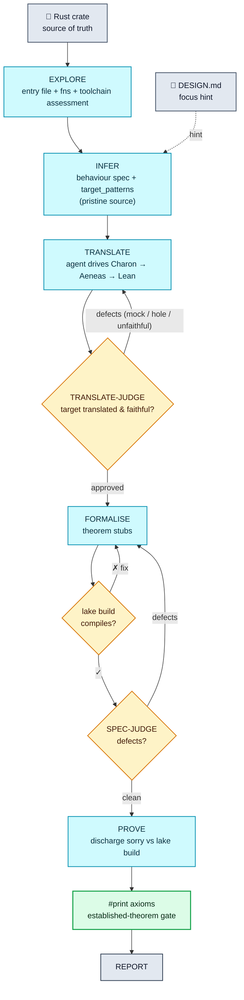

# Lusterna

An AI agent that translates Rust programs into formally verified Lean 4 specifications.

Given a Rust repository and a design document, Lusterna:

1. Explores the source (entry file + public functions) and empirically reality-checks the toolchain — building with Charon and a coarse Aeneas pass to record what is buildable, the external trust boundary, and which types must be modelled — as an advisory assessment for the later stages
2. Infers, from the code, the behavioural properties the target functions satisfy — and which functions the verification targets (the design document is only a focus hint; the code is the source of truth)
3. Translates the target to Lean 4 via [Charon](https://github.com/AeneasVerif/charon) + [Aeneas](https://github.com/AeneasVerif/aeneas), driving the toolchain to translate the target's own logic (never mocking it away)
4. States the properties as Lean 4 theorem stubs and builds them with `lake build`, iterating until they compile
5. Has a spec-judge list concrete defects in the theorem statements (checked against the translation and the inferred properties); revises until the list is empty
6. Fills in proofs with Lean 4 tactics against the `lake build` oracle
7. Runs `#print axioms` — the authoritative gate: a theorem is *established* only if its proof depends on nothing beyond the standard axioms (so an untranslated hole, a leftover `sorry`, `native_decide`'s compiler trust, or an assumed axiom all leave it reported as *tainted*, not verified)
8. Writes a verification report

Every stage that touches the container drives it through a single `bash` tool — running Charon, Aeneas, Cargo, Lake, and all file/git work itself. All artefacts are git-committed incrementally inside the toolchain container and pulled to the host on exit.

## Architecture

```
lusterna/
├── cli.py          — Click entry point; manages the container lifecycle
├── pipeline.py     — The pipeline: the stage phases (TranslatePhase, SpecPhase,
│                     ProvePhase) and run_session sequencing the stages
├── runner.py       — Generic stage-running machinery: per-stage prompt briefing,
│                     running a stage agent under history/limits, and tool wiring
├── stages.py       — Stage-agent definitions (prompt + output type per stage)
├── factory.py      — Agent factory: stage-agent construction + shared hooks
│                     (token tracking, budget enforcement, history snapshot,
│                     transient-error retry, server-side context compaction)
├── lean.py         — Aeneas/Lean domain logic: translation analysis, lake build,
│                     the #print axioms gate, and implementation-spec operations
├── tools.py        — The agent's `bash` + setup_lake_project tools, and the
│                     harness's own file/git IO helpers
├── schemas.py      — AgentDeps (the injected dependency bundle) + the Pydantic
│                     structured-output schemas
├── docs.py         — Aeneas/Lean skill documents embedded as agent instructions
├── container.py    — Docker lifecycle: start, push repo, exec, reset/pull artefacts
├── checkpoint.py   — Per-session numbered checkpoints + snapshot(deps) serialisation
├── telemetry.py    — Session-wide token-usage tracking
└── config.py       — Env-driven knobs, plus logging setup

tools/aeneas-characterize/   — build-time harness that measures Aeneas's translatable
                               fragment (see below); seeds the TRANSLATE skill.
```

### Pipeline



### TRANSLATE

TRANSLATE is where the target Rust becomes Lean. The agent drives Charon and Aeneas at the shell,
scoping to the target's functions (`--start-from`) and getting the target's own logic translated as
real Lean `def`s. Aeneas has a limited Rust fragment, so on larger targets some dependencies do not
translate. The agent handles each by the least-degrading option that works:

- **scope** — `--start-from` the target's call-closure and drop out-of-closure noise;
- **assume** — `--opaque` a trusted leaf dependency the properties do not reason about (crypto,
  hashing, transcripts, formatting); Aeneas emits it as a Lean `axiom`, which the `#print axioms`
  gate then flags on any theorem that depends on it;
- **model** — a behaviour-preserving source refactor when a data structure the properties *do*
  depend on has no Lean model (e.g. a `BTreeMap` ledger → an association list); confirmed against the
  crate's own `cargo test` and recorded, with the diff, in `translate/accountability.md`.

A **TRANSLATE-JUDGE** gates the result: it rejects a translation that mocks the target (opaques a
target function, or opaques a data structure whose contents a property constrains) or that changes
observable behaviour. Every alteration is disclosed for human review; if the target cannot be
translated without mocking it, the run aborts rather than emitting a hollow translation.

To make the agent recognise-and-apply rather than rediscover Aeneas's fragment every run, the
translatability playbook (`docs/skills/aeneas-translate.md`) is injected as a skill — a verdict table
(what translates / opaques / holes / rejects), the modelable-stdlib line, behaviour-preserving
recipes, and the charon/aeneas mechanics.

### The translatability inventory

The playbook is **measured**, not folklore. Aeneas's translatable fragment is defined by the
toolchain, so `tools/aeneas-characterize/` measures it directly rather than relying on anecdote:

- **What it does.** `characterize.py` runs a corpus of tiny single-construct probe crates (a `BTreeMap`,
  an iterator chain, an `Option` combinator, a closure, a trait object, …) through charon+aeneas once,
  in the toolchain image, and records the verdict for each — `def` (translates) / `axiom` (opaqued, no
  Lean model) / `hole` (`sorry`) / `error` (rejected). It also extracts Aeneas's builtin registry
  (`extract/ExtractBuiltin*.ml`) — the authoritative "what stdlib has a Lean model" set that decides
  def-vs-axiom. Output: `characterization.json`.
- **How to run it.** `python tools/aeneas-characterize/characterize.py` (needs the toolchain image and
  the editable-installed package). It prints a table and writes the JSON.
- **When.** On a toolchain-image bump — the fragment is version-specific. Then reconcile the playbook's
  verdict table and recipes with the fresh `characterization.json`.
- **What it is (and isn't).** It is an *inventory* — the constructs the playbook needs to speak to and
  what the toolchain does with each — not an exhaustiveness proof. Constructs a real target hits that
  the corpus missed surface in that run's `translate/accountability.md`, which is the intended feed for
  extending the corpus and the playbook over time.

### Docker interaction

The toolchain (Rust/Cargo, Charon, Aeneas, Lean/Lake) lives entirely inside a Docker container.
There are no bind-mounts: the source repo is pushed in via a tar pipe at session start and artefacts
are pulled back out at the end.

- The container has its own isolated filesystem — no host paths are exposed.
- The source is at `/workspace/repo` (git-initialised at a pristine baseline so any behaviour-
  preserving edit is captured as a diff), and generated artefacts go to `/workspace/out`.
- The container runs with `--cap-drop all` and `--security-opt no-new-privileges`. Network is enabled
  so Charon can `cargo build` targets whose dependencies are fetched on demand.

### Pipeline stages

Each stage agent is declared in `stages.py` (prompt + output type), constructed by `factory.py`, and
driven by `pipeline.py`. Each stage starts with a fresh context — stages communicate via the
filesystem (git-committed artefacts) and `deps.progress`, not via message history. Context-window
management is delegated to the model's native server-side context management — tool-result clearing
plus compaction of older messages once input tokens cross a threshold — so a long shell-driven stage
stays bounded without a client-side rewrite that would bust the prompt cache.

| Stage | Interface | Purpose |
|---|---|---|
| EXPLORE | `bash`, structured output | Identify the entry file and public functions, and reality-check the toolchain (build + coarse translate) into an advisory `ToolchainAssessment` |
| INFER | structured output | On the pristine Rust source, derive the behavioural properties **and** the Charon `target_patterns` that scope the target |
| TRANSLATE | `bash`, structured output | Drive Charon+Aeneas to translate the target (scope → assume → model → abort); log every alteration to `translate/accountability.md` |
| TRANSLATE-JUDGE | structured output | Reject a mocked / unfaithful / behaviour-changing translation; approval = empty defect list |
| FORMALISE | `bash`, structured output | Read the translation selectively (a name index + `bash`, not injected whole) and emit theorem stubs (statements only); the orchestrator assembles them and `lake build` is the convergence gate |
| SPEC-JUDGE | structured output | List concrete defects in the theorem statements; re-formalise until the list is empty |
| PROVE | `bash` | Attempt a proof for every `sorry` theorem against `lake build`; leaving hard theorems as `sorry` is honest |
| REPORT | `bash` | Produce `VERIFICATION_REPORT.md` from the injected artefacts |

The structured stages return structured output; FORMALISE cannot smuggle in a proof because its
output carries only statements (theorem bodies are assembled as `sorry` and only PROVE fills them).
The read-heavy stages navigate the translation via `bash` rather than having it injected whole. The
`#print axioms` gate after PROVE is the authoritative verdict; the report's headline metric is the
theorems it establishes that also reference an Aeneas-translated def.

### Checkpoints

After each stage the agent saves a numbered checkpoint under a per-session directory:

```
~/.local/share/lusterna/sessions/<session-id>/checkpoint-001.json …
```

Each records the progress dict, container ID, repo/work paths, design doc, and the `git_head` SHA of
`/workspace/out` at save time.

An interrupted run (token budget hit, provider outage past the retry budget, or a crash) is stopped
gracefully — never a traceback — and its container is **kept alive**, so a resume re-attaches to it
with full in-stage state (repo edits, artefacts, the accountability baseline) and continues rather
than restarting the stage. Only if that container is gone does resume rebuild a fresh one: it
restores the artefacts from `--out` and hard-resets the output repo to the checkpoint's `git_head`,
continuing from exactly that state — never from whatever drifted onto disk.

## Requirements

- Python 3.10+
- Docker (with access to the Docker daemon)
- An Anthropic API key (`ANTHROPIC_API_KEY`)

## Installation

```sh
python3 -m venv .venv
source .venv/bin/activate
pip install -e .
```

## Quickstart

```sh
# 1. Build the toolchain image (one-time)
lusterna build-image

# 2. Run the pipeline
export ANTHROPIC_API_KEY=sk-...
lusterna run /path/to/rust-repo /path/to/design.md

# Artefacts land in /path/to/rust-repo-lusterna/ by default; override with --out.
```

## Commands

### `run`

```
lusterna run REPO DESIGN_DOC [OPTIONS]
```

| Option | Default | Description |
|---|---|---|
| `--out DIR` | `<repo>-lusterna/` | Host directory to pull artefacts into |
| `--session-id ID` | (new UUID) | Resume a previous session |
| `--checkpoint-number N` | (latest) | Checkpoint to resume from within a session |
| `--container NAME` | (auto-start) | Attach to a pre-running toolchain container |
| `--image TAG` | `lusterna-toolchain:latest` | Image to start when `--container` is not given |
| `--token-budget N` | (unlimited) | Maximum total tokens across all agents; 0 = unlimited |

Output is JSON on stdout (`session_id`, `out_dir`, `container_id`, `summary`, `progress_keys`);
progress and errors go to stderr as structured log lines.

### Other commands

```
lusterna build-image [--tag TAG]      # build the toolchain image (required before the first run)
lusterna list-sessions                # sessions that have at least one checkpoint
lusterna list-checkpoints SESSION_ID  # checkpoints for a session (JSON)
lusterna show-checkpoint SESSION_ID [--number N]   # a checkpoint's state (JSON)
```

## Environment variables

| Variable | Default | Description |
|---|---|---|
| `ANTHROPIC_API_KEY` | — | **Required.** Anthropic API key |
| `LUSTERNA_MODEL` / `LUSTERNA_JUDGE_MODEL` | `anthropic:claude-opus-4-8` | Model for the stage / judge agents |
| `LUSTERNA_EFFORT` | `high` | Extended-thinking effort (low/medium/high) for the stage agents |
| `LUSTERNA_MAX_TOKENS` | `32000` | Max output tokens per model request |
| `LUSTERNA_SESSIONS_DIR` | `~/.local/share/lusterna/sessions` | Root for per-session checkpoints |
| `LUSTERNA_IMAGE` | `lusterna-toolchain:latest` | Default Docker image |
| `LUSTERNA_CONTAINER` | — | Pre-existing container to attach to (skips auto-start) |
| `LUSTERNA_TOKEN_BUDGET` | (unlimited) | Max total tokens across all agents; 0/unset = unlimited |
| `LUSTERNA_BUILD_TIMEOUT` | `180` | Per-`lake` timeout (seconds) |
| `LUSTERNA_MODEL_RETRY_ATTEMPTS` / `LUSTERNA_MODEL_RETRY_BASE_DELAY` | `10` / `2.0` | Transient-error (overload/5xx) retry attempts and backoff base (seconds) |
| `LUSTERNA_COMPACTION_THRESHOLD` | `200000` | Input-token threshold for server-side context compaction |
| `LUSTERNA_STALL_ROUNDS` | `3` | Consecutive no-progress rounds before an agent+judge loop (TRANSLATE / FORMALISE) gives up; also FORMALISE's per-theorem quarantine threshold. No hard round cap — the token budget is the resource guard |
| `LUSTERNA_STOP_AFTER_TRANSLATE` | (off) | Stop after TRANSLATE so the translation can be inspected |
| `LUSTERNA_STOP_BEFORE_PROVE` | (off) | Stop after SPEC-JUDGE so the inferred spec can be inspected (no prove/report) |
| `LUSTERNA_LOG_LEVEL` | `INFO` | `DEBUG` / `INFO` / `WARNING` / `ERROR` |

## Resuming a session

```sh
lusterna list-sessions
lusterna list-checkpoints <session-id>

# Resume from the latest checkpoint (or a specific one with --checkpoint-number N).
# No manual git reset: the output repo is pinned to that checkpoint's git_head automatically.
lusterna run /path/to/repo design.md --session-id <uuid> --out /path/to/out
```

## Output artefacts

After a run, `<out_dir>/` is a git repository with one commit per stage:

```
<out_dir>/
├── lean/
│   ├── <Crate>.lean          — Aeneas translation (root module)
│   ├── <Crate>/…             — translation submodules + <Crate>/Spec.lean (the theorem spec)
│   └── lakefile.lean         — Lake project file
├── specs/
│   └── informal_spec.json    — the inferred behavioural properties
├── translate/
│   └── accountability.md     — every scope/opaque/edit and why it is behaviour-preserving
├── report/                   — the individual sections composing the report
└── VERIFICATION_REPORT.md    — theorem status, assumptions, proof sketches
```
